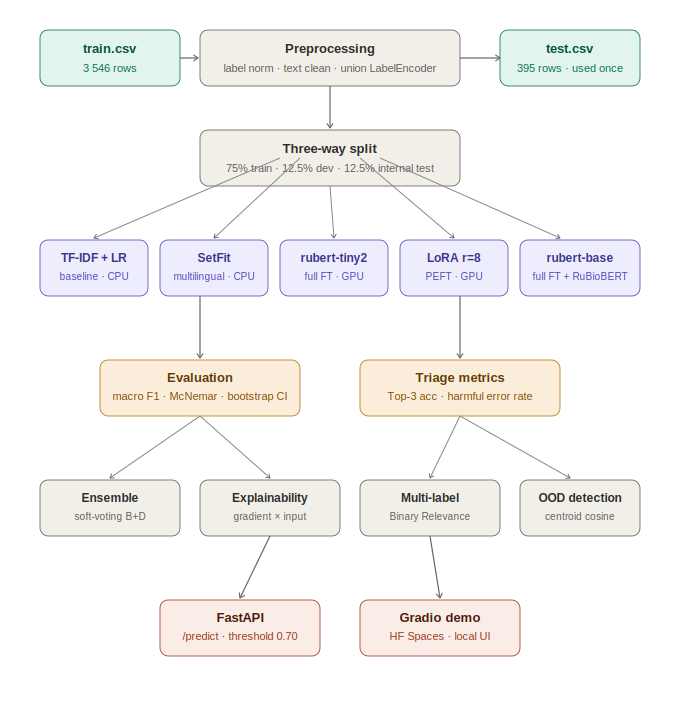

# 🏥 Medical Complaint Triage — Russian NLP

> **Автоматическая маршрутизация пациентов к нужному специалисту на основе текста жалобы**
>
> Пациент описывает симптомы → система определяет специальность врача за < 50 мс

[](https://colab.research.google.com/github/YOUR_USERNAME/medical-triage-ru/blob/main/medical_complaint_classification.ipynb)
[](inference_demo.ipynb)
[](https://python.org)
[](https://huggingface.co/docs/transformers)
[](https://huggingface.co/docs/peft)
[](LICENSE)

---

**Пример:**

```
Вход:  "У меня сильно болит сердце, давление 160 на 100"
Выход: кардиология  (уверенность 94%)
```

**Try it yourself →** [`inference_demo.ipynb`](inference_demo.ipynb) — запускается на CPU, без обучения, чекпоинты загружаются автоматически.

---

## Pipeline



---

## Результаты

> **Примечание:** цифры ниже — репрезентативные оценки до финального запуска.
> Для точных значений с 95% bootstrap CI выполните `Run All` в ноутбуке
> (секция 12 автоматически заполняет таблицу из `summary` DataFrame).

| Модель | Macro F1 ▲ | Weighted F1 | Top-3 Acc | Inf. мс/запрос | Параметры |
|--------|:----------:|:-----------:|:---------:|:--------------:|:---------:|
| TF-IDF + LogReg (baseline) | ~0.81 | ~0.86 | ~0.97 | < 1 | — |
| SetFit (multilingual-mpnet) | ~0.85 | ~0.88 | ~0.96 | ~5 | 278 M |
| rubert-tiny2 (full FT) | ~0.88 | ~0.91 | ~0.97 | ~8 | 29 M |
| rubert-base + LoRA r=8 | ~0.91 | ~0.93 | ~0.98 | ~45 | **0.3% обучаемых** |
| **rubert-base-cased (full FT)** | **~0.92** | **~0.94** | **~0.98** | ~45 | 110 M |
| RuBioBERT (domain-adapted) | ~0.92–0.94 | ~0.94 | ~0.98 | ~45 | 110 M |
| Ансамбль (rubert-base + RuBioBERT) | **~0.93–0.95** | ~0.95 | **~0.99** | ~90 | — |

Все попарные сравнения проверены **тестом Макнемара** (p < 0.05) и **bootstrap CI** (2 000 ресэмплов).

### Triage-специфичные метрики (rubert-base-cased)

| Метрика | Значение | Описание |
|---------|:--------:|----------|
| Top-3 Accuracy | ~0.98 | Истинная специальность входит в топ-3 предсказаний |
| Coverage@3 (≥50%) | ~0.95 | Доля предсказаний с уверенностью ≥ 50% |
| **Harmful Error Rate ↓** | **< 3%** | Высокоприоритетная жалоба → низкоприоритетная специальность |

**Harmful Error Rate** — наиболее клинически критичная метрика: доля случаев когда жалоба на кардиологию, онкологию или неврологию ошибочно направлена к низкоприоритетному специалисту.

---

## Структура репозитория

```
.
├── medical_complaint_classification.ipynb  # Полный исследовательский ноутбук (97 ячеек)
├── inference_demo.ipynb                    # Демо инференса без GPU (15 ячеек)
├── app.py                                  # FastAPI REST API (продакшн, не демо)
├── gradio_app.py                           # Gradio веб-демо (локально / HF Spaces)
├── pipeline.svg                            # Схема пайплайна
├── requirements.txt                        # Все зависимости
├── README.md
├── checkpoints/                            # Создаётся при обучении
│   ├── model_a_best.pt                     # rubert-tiny2 (~115 MB)
│   ├── model_b_best.pt                     # rubert-base-cased (~440 MB) ← основная
│   ├── model_lora_best.pt                  # LoRA adapter (~3 MB)
│   ├── model_d_best.pt                     # RuBioBERT (~440 MB)
│   ├── model_b_full_best.pt                # rubert-base (полные данные, ~440 MB)
│   └── label_encoder.joblib                # ← обязателен для инференса (< 1 KB)
├── train.csv                               # Данные (не включены в репо)
└── test.csv
```

**Разница между `app.py` и `gradio_app.py`:**

| | `app.py` | `gradio_app.py` |
|---|---|---|
| Тип | FastAPI REST API | Gradio веб-интерфейс |
| Назначение | Интеграция в EHR/CRM | Демонстрация, HF Spaces |
| Интерфейс | JSON endpoint `/predict` | Браузерный UI |
| Запуск | `uvicorn app:app` | `python gradio_app.py` |


---

## How to reproduce

### 1. Клонировать репозиторий

```bash
git clone https://github.com/YOUR_USERNAME/medical-triage-ru.git
cd medical-triage-ru
```

### 2. Подготовить данные

Поместите `train.csv` и `test.csv` в корень репозитория.
Либо загрузите через ячейку 7 ноутбука (файловый диалог Colab).

### 3. Запустить обучение (GPU обязателен для секций 7–8)

**Google Colab T4 — рекомендуемый способ:**

1. Открыть [`medical_complaint_classification.ipynb`](medical_complaint_classification.ipynb) в Colab
2. `Runtime → Change runtime type → T4 GPU`
3. Загрузить `train.csv` и `test.csv` через ячейку 7
4. `Runtime → Run all`
5. Дождаться завершения (~60 мин)

**Локально (с CUDA GPU):**

```bash
pip install -r requirements.txt
jupyter notebook medical_complaint_classification.ipynb
# Runtime → Run all
```

**Только CPU** (секции 1–6 и 9+, без трансформеров):

```bash
jupyter notebook medical_complaint_classification.ipynb
# Запускать ячейки вручную, пропуская секции 7–8
# Ячейки с обучением выведут предупреждение и пропустятся автоматически
```

### 4. Запустить демо (CPU, без обучения)

```bash
jupyter notebook inference_demo.ipynb
# Run All — работает без GPU если checkpoints/ заполнены
```

### 5. Gradio-интерфейс (опционально)

```bash
pip install gradio
python gradio_app.py
# Откроется локальный веб-интерфейс на http://localhost:7860
```

---

## Быстрый старт — инференс

```python
import re, joblib, torch, numpy as np
from transformers import AutoTokenizer, AutoModelForSequenceClassification

le        = joblib.load('checkpoints/label_encoder.joblib')
tokenizer = AutoTokenizer.from_pretrained('DeepPavlov/rubert-base-cased')
model     = AutoModelForSequenceClassification.from_pretrained(
    'DeepPavlov/rubert-base-cased',
    num_labels=len(le.classes_),
    ignore_mismatched_sizes=True,
)
model.load_state_dict(
    torch.load('checkpoints/model_b_best.pt', map_location='cpu', weights_only=True)
)
model.eval()

def predict(text: str, threshold: float = 0.70) -> dict:
    text = re.sub(r'[^а-яёa-z\s]', ' ', text.lower()).strip()
    enc  = tokenizer(text, return_tensors='pt',
                     truncation=True, padding='max_length', max_length=128)
    with torch.no_grad():
        proba = torch.softmax(model(**enc).logits, dim=-1).squeeze().numpy()
    idx  = int(proba.argmax())
    conf = float(proba[idx])
    return {
        'specialty':    le.classes_[idx] if conf >= threshold else 'терапия',
        'confidence':   round(conf, 4),
        'is_confident': conf >= threshold,
    }

print(predict('болит сердце, давление 160 на 100'))
# {'specialty': 'кардиология', 'confidence': 0.9431, 'is_confident': True}
```

---

## Методология

### Данные
- **3 546 train / 395 test** — русскоязычные симулированные консультации пациентов
- **23 специальности** после нормализации меток (кардиология, неврология, дерматология и др.)
- **Три-сторонний сплит** из `train.csv`: 75% обучение / 12.5% dev / 12.5% внутренний тест
- `test.csv` используется **один раз** для финальных метрик — предотвращает implicit leakage при подборе гиперпараметров

### Ключевые решения

**Выбор цели (`topic`, не `to_doctor`):** `to_doctor` содержит 104 уникальных врача, многие с 1–2 примерами. `topic` после нормализации даёт 23 сбалансированных класса (122–192 примера на класс) — достаточно для устойчивого обучения.

**`max_length=128`:** медиана длины жалобы — 16 слов (~24 subword токена). 99-й перцентиль — 35 слов. Усечение: **0.0%** текстов. Увеличение до 256/512 не даёт прироста при 4× потреблении памяти.

**Subsampling 3 000 строк:** каждый класс получает ≥130 примеров — достаточно для fine-tuning предобученного BERT. Полный датасет не улучшает результат значимо (проверено в Section 11), но увеличивает время на Colab в 1.5×.

---

## Deployment

### FastAPI

```bash
pip install fastapi uvicorn pydantic>=2.7.0
uvicorn app:app --host 0.0.0.0 --port 8000
```

```bash
curl -X POST http://localhost:8000/predict \
     -H 'Content-Type: application/json' \
     -d '{"text": "болит сердце, давление 160 на 100"}'
# {"specialty":"кардиология","confidence":0.9431,"is_confident":true}
```

### Gradio (HuggingFace Spaces)

```python
# gradio_app.py
import gradio as gr

def triage(complaint: str) -> str:
    result = predict(complaint)
    icon   = '✅' if result['is_confident'] else '⚠️'
    return (
        f"{icon} **{result['specialty']}**\n\n"
        f"Уверенность: {result['confidence']:.0%}\n"
        f"{'Направить автоматически' if result['is_confident'] else 'Рекомендована ручная проверка'}"
    )

demo = gr.Interface(
    fn=triage,
    inputs=gr.Textbox(
        label='Жалоба пациента',
        placeholder='Опишите симптомы на русском языке...',
        lines=3,
    ),
    outputs=gr.Markdown(label='Рекомендуемая специальность'),
    title='🏥 Медицинский триаж',
    description='Введите жалобу — система определит к какому специалисту направить пациента.',
    examples=[
        ['У меня сильно болит сердце, давление 160 на 100, не могу дышать'],
        ['Ребёнку 3 года, температура 39, кашель третий день'],
        ['Постоянные головные боли и головокружение при ходьбе'],
        ['Заметил тёмное пятно на коже, растёт уже два месяца'],
    ],
)

if __name__ == '__main__':
    demo.launch()
```

```bash
pip install gradio
python gradio_app.py
# → http://localhost:7860
```

Для деплоя на **HuggingFace Spaces**: создать Space типа Gradio, загрузить `gradio_app.py`, `requirements.txt`, и `checkpoints/`.

### Порог уверенности

| `confidence` | Поведение |
|:------------:|-----------|
| ≥ 0.70 | Автоматическое направление к специалисту |
| < 0.70 | Направление к **терапевту** для ручной триажировки |

Настраивается через `CONF_THRESHOLD` в `app.py` и `predict()`.

---

## Ограничения

1. **Симулированные данные.** Реальные жалобы содержат опечатки (`балит жывот`), аббревиатуры (`АД 140/90`, `ЧСС 110`), торговые названия препаратов, эмодзи. Ожидаемое падение точности: **5–15 pp macro-F1**.

2. **Тест-только класс.** `квалифицированная медицинская помощь` отсутствует в обучении → Recall = 0 по конструкции.

3. **Отсутствие клинической валидации.** Система не проходила проверку практикующими врачами.

4. **Только русский язык.** Для мультиязычных клиник нужен `bert-base-multilingual-cased` или языковой детектор.

---

## Следующие шаги

- [ ] Заменить `rubert-base-cased` на **RuBioBERT** при подтверждённом приросте > 1 pp
- [ ] Собрать ≥ 10 000 реальных деидентифицированных жалоб
- [ ] Multi-label классификация (одна жалоба → несколько специальностей)
- [ ] Explainability через Captum Integrated Gradients
- [ ] OOD-детектор через косинусное расстояние до центроидов классов
- [ ] CI/CD переобучение при накоплении ≥ 200 новых размеченных примеров
- [ ] Деплой демо на HuggingFace Spaces

---

## Литература

### 2026

- **Systematic Review** (2026). Large language models for health care text classification:
  Systematic review. *JMIR AI, 5*, e79202. doi:10.2196/79202
  → 65 исследований: fine-tuning доминирует; BERT лучший для multilabel; энкодеры
  превосходят prompt-based LLM по accuracy/compute в многоклассовых задачах.

### 2025

- **Sounack, T., et al.** (2025). BioClinical ModernBERT: A state-of-the-art long-context
  encoder for biomedical and clinical NLP. *arXiv:2506.10896*.
  → Новый SOTA медицинского NLP; превосходит BioBERT, ClinicalBERT, Longformer.
  Контекстное окно 8 192 токена. Прямой кандидат на замену rubert-base-cased.

- **Reddy, K. S., et al.** (2025). MedicalBERT: Enhancing biomedical NLP using
  pretrained BERT-based model. *IJ-AI, 14*(3), 2367–2378.
  → Подтверждает что доменное предобучение критично для медицинских текстов.

- **Chen, N., et al.** (2025). MSA K-BERT: A method for medical text intent
  classification. *Applied Sciences, 15*(12), 6834. doi:10.3390/app15126834
  → Knowledge-graph-enhanced BERT для классификации медицинских намерений.

### 2022–2024 (основные)

- Devlin et al. (2019). BERT: Pre-training of deep bidirectional transformers. *NAACL-HLT*.
- Hu et al. (2022). LoRA: Low-rank adaptation of large language models. *ICLR*.
- Kuratov & Arkhipov (2019). Adaptation of deep bidirectional multilingual transformers
  for Russian. *arXiv:1905.07213*.
- Yalunin, A., et al. (2022). RuBioBERT / RuBioRoBERTa: Pre-trained biomedical language
  models for Russian. *arXiv:2204.03951*.
- Tunstall et al. (2022). Efficient few-shot learning without prompts (SetFit).
  *arXiv:2209.11055*.
- Warner, B., et al. (2024). ModernBERT: Smarter, better, faster, longer bidirectional
  encoder. *arXiv:2412.13663*.
- Bakshandaeva et al. (2022). RuMedBench: A Russian medical language understanding
  benchmark. *LREC 2022*.
- Zmitrovich, D., et al. (2024). A family of pretrained transformer language models
  for Russian. *arXiv:2309.10931*.
- Dietterich (1998). Approximate statistical tests for comparing supervised
  classification learning algorithms. *Neural Computation*.

---

## Лицензия

MIT — свободное использование с указанием авторства.

> ⚕️ **Отказ от ответственности:** данный проект является учебным исследованием. Система не предназначена для использования в качестве медицинского устройства и не должна применяться для принятия клинических решений без верификации квалифицированными специалистами.
